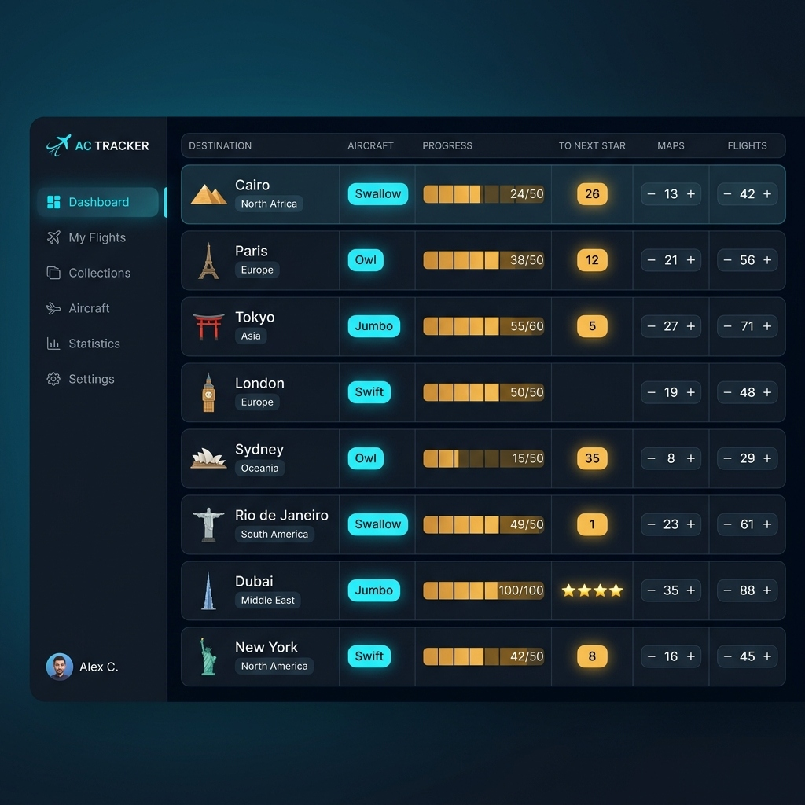

# ✈️ AC TRACKER

> A sleek, cyber-inspired Flight & Destination Fleet Monitor web application modeled faithfully after the airport city flight tracker dashboard.



## ✨ Features

- **Pixel-Fidelity Aesthetic**: Deep dark glassmorphism, ambient cyan/amber neon backlighting, and glowing status pills.
- **Handcrafted Landmark Art**: Custom SVG vector artwork for iconic destinations:
  - 🏜️ **Cairo** (Great Pyramids)
  - 🗼 **Paris** (Eiffel Tower)
  - ⛩️ **Tokyo** (Torii Gate)
  - 🕰️ **London** (Elizabeth Tower / Big Ben)
  - ⛵ **Sydney** (Sydney Opera House)
  - 🗽 **Rio de Janeiro** (Christ the Redeemer)
  - 🏙️ **Dubai** (Burj Khalifa)
  - 🗽 **New York** (Statue of Liberty)
- **Segmented Golden Progress Bars**: 6-tier gold-lit blocks displaying real-time progress toward mastery (`24/50`, `38/50`, etc.).
- **Glowing Star Badges**: Amber glowing milestones with dynamic star calculations and festive confetti celebrations upon star unlocks.
- **Interactive Steppers**: Responsive `[- count +]` controls for Maps and Flights with Web Audio tactical click sounds and state persistence.
- **Full Section Navigation**:
  - **Dashboard**: Main live fleet & destination tracker.
  - **My Flights**: Active operational air corridors and takeoff statuses.
  - **Collections**: Rare destination drops, souvenirs, and relics.
  - **Aircraft**: Fleet specifications (Swallow, Owl, Jumbo, Swift).
  - **Statistics**: Global analytics, flight telemetry, and aircraft distribution.
  - **Settings**: Audio toggles, particle controls, and reset to defaults.
- **Local Persistence**: State automatically persists across page refreshes using `localStorage`.

---

## 🚀 Quick Start

### Prerequisites
- Node.js (v18+ recommended)
- npm

### Development
```bash
# Install dependencies
npm install

# Start local dev server
npm run dev
```

### Production Build
```bash
npm run build
npm run preview
```

---

## 🌐 Deploy to GitHub Pages

This project is pre-configured with a GitHub Actions workflow in `.github/workflows/deploy.yml`.

### Step 1: Create a repository on GitHub
Create a new GitHub repository (e.g. `ac-tracker` or `bond`).

### Step 2: Push your local repository to GitHub
```bash
git remote add origin https://github.com/<your-username>/<your-repo-name>.git
git branch -M main
git push -u origin main
```

### Step 3: Enable GitHub Pages in your Repository Settings
1. Go to your GitHub repository -> **Settings** -> **Pages**.
2. Under **Build and deployment** > **Source**, select **GitHub Actions**.
3. The workflow will automatically trigger, build the application, and deploy it to `https://<your-username>.github.io/<your-repo-name>/`.
